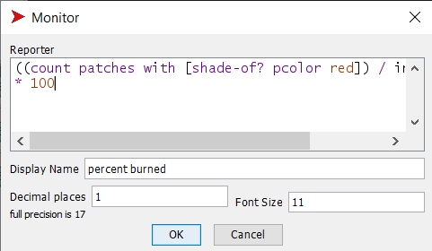
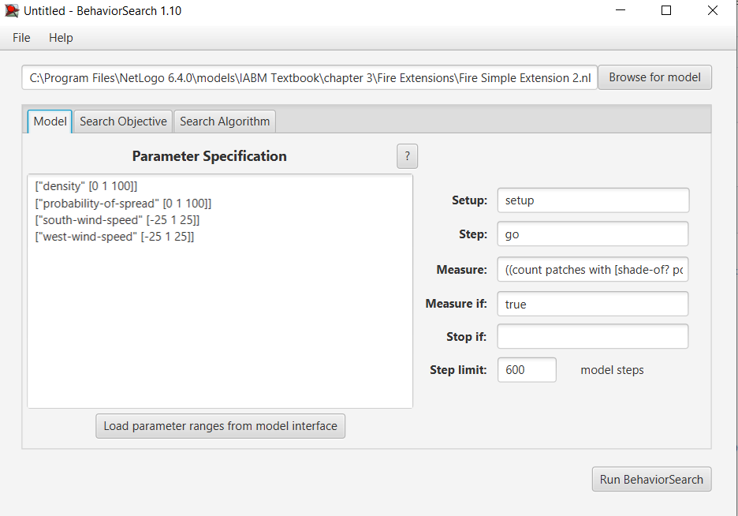
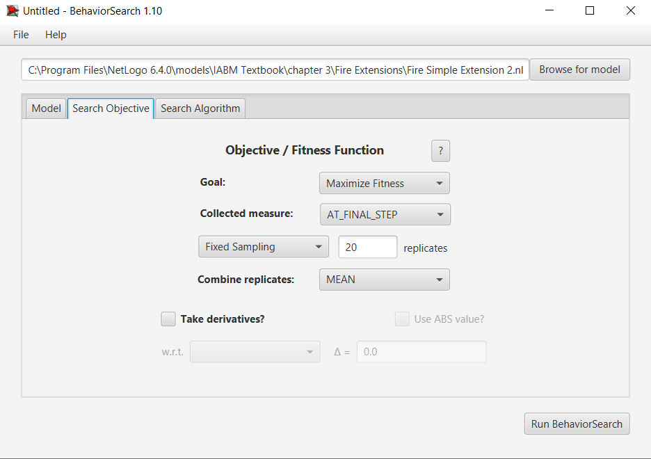
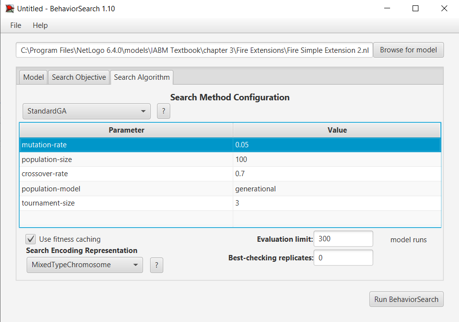
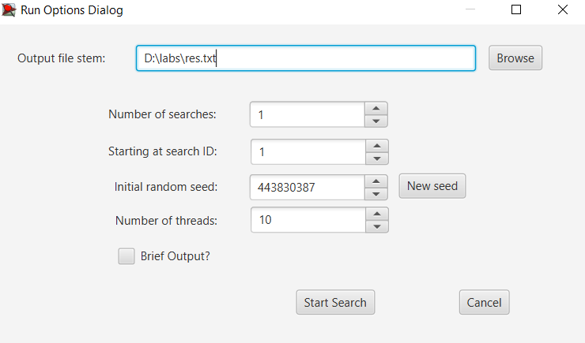
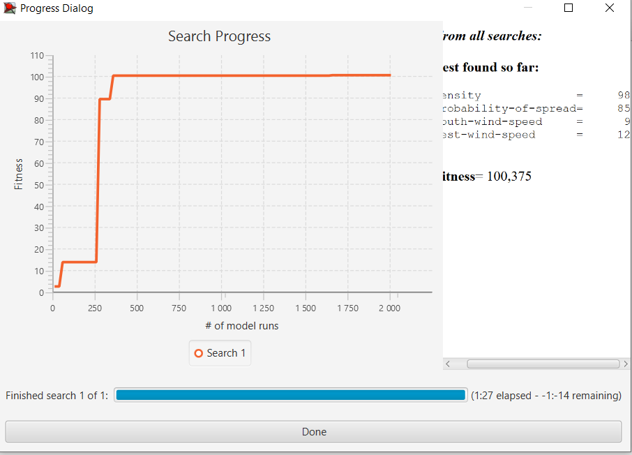
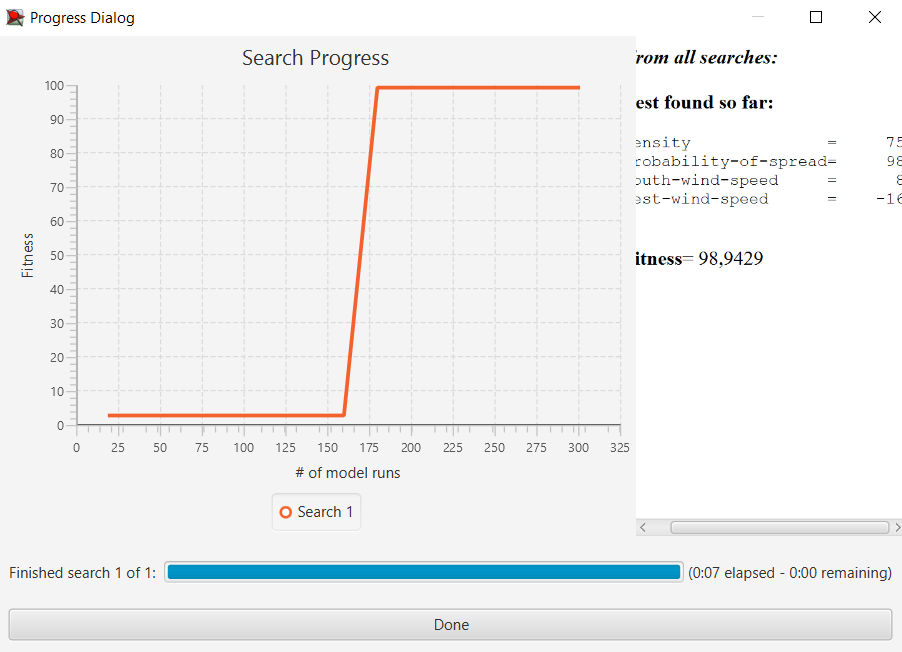

## Комп'ютерні системи імітаційного моделювання
## СПм-22-4, Самойлов Іван
### Лабораторна робота №**3**. Використання засобів обчислювального интелекту для оптимізації імітаційних моделей

### Варіант 5, модель у середовищі NetLogo:
[Fire Simple Extension 2](http://www.netlogoweb.org/launch#http://www.netlogoweb.org/assets/modelslib/IABM%20Textbook/chapter%203/Fire%20Extensions/Fire%20Simple%20Extension%202.nlogo)

### Вербальний опис моделі:

 - [Lab 1](https://github.com/ivansamoyloff/lab1)
 
### Налаштування середовища BehaviorSearch:

**Обрана модель**:
<pre>
C:\Program Files\NetLogo 6.4.0\models\IABM Textbook\chapter 3\Fire Extensions\Fire Simple Extension 2.nlogo
</pre>

Для адекватної роботи моделі, її було змінено. Закоментавно команду зупинки симуляції:
<pre>
 if all? patches [ pcolor != red ] [ stop ]
</pre>

**Параметри моделі** (вкладка Model):  
<pre>
["density" [0 1 100]]
["probability-of-spread" [0 1 100]]
["south-wind-speed" [-25 1 25]]
["west-wind-speed" [-25 1 25]]
</pre>
Використовувана **міра**:  
Для фітнес-функції (вона ж функція пристосованості або цільова функція) було обрано **значення відсотока спалених дерев**, вираз для розрахунку взято з налаштувань аналізованої імітаційної моделі в середовищі NetLogo:

та вказано в параметрі"**Measure**":
<pre>
((count patches with [shade-of? pcolor red]) / initial-trees) * 100
</pre>
Відсоток спалених дерев враховується лише на останньому такті симуляції тривалість якої 600 тактів, починаючи з 0 такту симуляції.  
Параметр зупинки за умовою **("Stop if")** не використовувався.

Загальний вигляд вкладки налаштувань параметрів моделі:

**Налаштування цільової функції** (вкладка Search Objective):  
Метою підбору параметрів імітаційної моделі, що описує пожежу в лісі, є **максимізація** відсотка спалених дерев – це вказано через параметр "**Goal**" зі значенням **Maximize Fitness**. Тобто необхідно визначити такі параметри налаштувань моделі, у яких максимальня кількість дерев згорає. Цікавить лише фінальне значення вигорілих дерев. Для цього у параметрі "**Collected measure**", що визначає спосіб обліку значень обраного показника, вказано **AT_FINAL_STEP**.  
Модель дуже чутлива до випадкових значень. Тому, щоб уникнути викривлення результатів через випадкові значення, що використовуються в лозіці самої імітаційної моделі, **кожна симуляція повторюється по 20 разів**, результуюче значення розраховується як **середнє арифметичне**. 
Загальний вигляд вкладки налаштувань цільової функції:

**Налаштування алгоритму пошуку** (вкладка Search Algorithm):  
Загальний вид вкладки налаштувань алгоритму пошуку: 

 

### Результати використання BehaviorSearch:
Діалогове вікно запуску пошуку 

Результат пошуку параметрів імітаційної моделі, використовуючи **генетичний алгоритм**:

Результат пошуку параметрів імітаційної моделі, використовуючи **випадковий пошук**:

 
